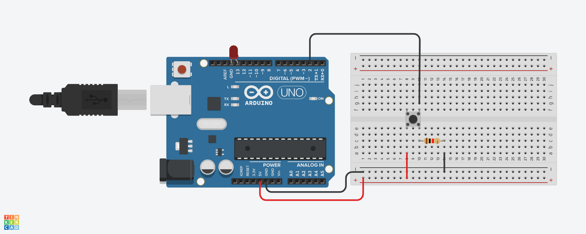

# Push Button 

one of the special tools differs from the switch button for allowing the Arduino to on/off with a momentary position.

### Requested Materials: 
- Arduino UNO
- BreadBoard 
- Push Button 
- LED 
- Resistor 
- Jumper Wires 

### Connection: 

- Place the pushbutton anywhere between the two sides of the breadboard 
- Connect the led with the arduino board. 
- attach the resister to the button's leg
- supply the wires between the breadboard and the arduino. 
- Connect the wires as shown in the figure below. 



### Programming Code: 
```
//pin 2: Input for reading the button 
//pin 13: Output fot controlling the LED

int Button = 2; 
int LED = 13; 

void setup()
{
  pinMode(Button, INPUT);
  pinMode(LED, OUTPUT);
}

void loop()
{
  if(digitalRead(Button) == 1)
  {
    digitalWrite(LED, HIGH);
  }
  else 
  {
    digitalWrite(LED, LOW);
  }
}
```

#### Tinkercard design link: 
https://www.tinkercad.com/things/cnZoFvnCFMD 
